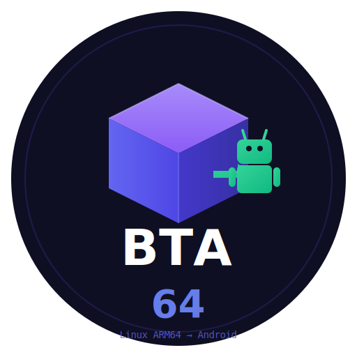

<p align="center">
  
</p>

<h1 align="center">BTA64: Run Linux Programs on Android ARM64</h1>

<p align="center">
  <a href="#-about">About</a> •
  <a href="#-features">Features</a> •
  <a href="#-quick-start">Quick Start</a> •
  <a href="#-x64-translation">x64 Translation</a> •
  <a href="#-api-reference">API</a> •
  <a href="#%EF%B8%8F-building">Building</a> •
  <a href="#-how-it-works">How It Works</a> •
  <a href="README_CN.md">中文</a>
</p>

<p align="center">
  
  
  
  
</p>

---

BTA64 enables running **both ARM64 and x64 Linux programs** on Android devices:

- **ARM64 binaries**: Run natively with glibc→bionic compatibility layer (no emulation)
- **x64 binaries**: Translate x64→ARM64 on-the-fly (JIT) or pre-compile (AOT)

> Inspired by [Box64](https://github.com/ptitSeb/box64) and [FEX-Emu](https://github.com/FEX-Emu/FEX)

---

## 📖 About

BTA64 is a **unified runtime** that automatically detects ELF architecture and runs it appropriately:

| Binary Type | How It Runs |
|-------------|-------------|
| **ARM64 (glibc)** | Native execution with glibc compatibility layer |
| **x64 (x86-64)** | Translate to ARM64 using JIT or AOT |

### Why BTA64?

| Advantage | Description |
|-----------|-------------|
| 🚀 **Native Speed** | ARM64 binaries run without emulation |
| 🔄 **x64 Support** | Run x86-64 Linux apps via translation |
| 📦 **Unified Runner** | One command handles both architectures |
| ⚡ **JIT + AOT** | Real-time translation or pre-compiled cache |
| 📱 **Android Ready** | Works on Android ARM64 devices |

---

## ✨ Features

### Core Capabilities

- **Auto Architecture Detection**: Automatically detects ARM64 or x64 ELF
- **glibc Compatibility**: ~350+ glibc symbols mapped to bionic
- **x64→ARM64 Translation**: JIT dynarec and AOT compilation
- **ELF Loading**: Full support for PIE and dynamically linked executables
- **Output Capture**: Capture stdout/stderr from executed programs

### x64 Translation Features

| Feature | Description |
|---------|-------------|
| **JIT Mode** | Translate x64 code blocks on-demand (default) |
| **AOT Mode** | Pre-compile to ARM64 .so files for faster startup |
| **Deferred Flags** | Optimized flags computation for performance |
| **Register Caching** | x64 registers cached in ARM64 registers |

---

## 🚀 Quick Start

### Command Line (Unified Runner)

```bash
# Run any Linux ELF - auto-detects architecture
bta64-run ./my_program arg1 arg2

# The runner automatically:
# - ARM64 binary → runs with glibc compatibility
# - x64 binary   → translates to ARM64 and runs
```

### Check Binary Architecture

```bash
bta64-run --info ./my_binary

# Output:
# ELF Information: ./my_binary
#   Architecture: x86-64
#   Type:         PIE (Position Independent)
#   -> Will run with x64->ARM64 translation
```

### C API Usage

```c
#include "bta64_api.h"

int main() {
    // Initialize runtime
    bta64_t bta = bta64_init(NULL);
    
    // Execute a Linux ARM64 program
    char* args[] = {"hello", "world", NULL};
    bta64_result_t result;
    
    int ret = bta64_exec(bta, "/path/to/linux_program", 2, args, NULL, &result);
    
    if (result.exited) {
        printf("Exit code: %d\n", result.exit_code);
    }
    
    // Cleanup
    bta64_result_free(&result);
    bta64_cleanup(bta);
    
    return ret;
}
```

---

## 🔄 x64 Translation

BTA64 includes a complete x64→ARM64 translator inspired by Box64.

### Translation Modes

#### JIT Mode (Default)
Translates x64 code blocks on-demand during execution.

```bash
# JIT mode (default)
bta64-run ./x64_program

# Explicit JIT mode
BTA64_MODE=jit bta64-run ./x64_program
```

#### AOT Mode
Uses pre-compiled ARM64 code for faster startup.

```bash
# Pre-compile x64 binary to ARM64
bta64-run --aot-compile ./x64_program
# Creates: ./x64_program.aot.so

# Run with AOT cache
BTA64_MODE=aot bta64-run ./x64_program
```

### Environment Variables

| Variable | Values | Description |
|----------|--------|-------------|
| `BTA64_MODE` | `jit` (default), `aot` | Translation mode |
| `BTA64_AOT_PATH` | directory path | AOT cache directory |
| `BTA64_VERBOSE` | `1` | Enable verbose output |
| `BTA64_DEBUG` | `1` | Enable debug output |
| `BTA64_LOG_LEVEL` | `0`-`5` | Log level |

### Workflow Example

```bash
# 1. Check architecture
bta64-run --info ./app
# Output: Architecture: x86-64

# 2. First run with JIT
bta64-run ./app

# 3. Pre-compile for faster subsequent runs
bta64-run --aot-compile ./app

# 4. Run with AOT cache
BTA64_MODE=aot bta64-run ./app
```

---

## 📚 API Reference

### Initialization

```c
// Initialize with default config
bta64_t bta64_init(const bta64_config_t* config);

// Cleanup and free resources
void bta64_cleanup(bta64_t bta);
```

### Configuration

```c
typedef struct {
    bta64_log_level_t log_level;    // BTA64_LOG_NONE to BTA64_LOG_DEBUG
    size_t stack_size;               // Default: 8MB
    int redirect_output;             // Capture stdout/stderr
    int use_tls;                     // Setup glibc-compatible TLS
    const char* lib_path;            // Library search path
} bta64_config_t;
```

### Execution

```c
// Load and run in one call
int bta64_exec(bta64_t bta, const char* path,
               int argc, char** argv, char** envp,
               bta64_result_t* result);

// Simple one-shot execution
int bta64_simple_exec(const char* path, int argc, char** argv);
```

### Execution Result

```c
typedef struct {
    int exit_code;      // Exit code (if exited normally)
    int signal;         // Signal number (if killed)
    int exited;         // 1 = normal exit, 0 = signal
    char* stdout_buf;   // Captured stdout
    size_t stdout_len;
    char* stderr_buf;   // Captured stderr
    size_t stderr_len;
} bta64_result_t;
```

---

## 🛠️ Building

### Prerequisites

- **Android**: Android NDK r21+ (API 29+)
- **Linux**: GCC/Clang with ARM64 support
- **Standard**: C11

### CMake Build

```bash
mkdir build && cd build
cmake .. -DBTA64_X64_TRANSLATOR=ON
make -j$(nproc)
```

### Build Options

| Option | Default | Description |
|--------|---------|-------------|
| `BTA64_X64_TRANSLATOR` | ON | Enable x64→ARM64 translation |
| `BTA64_JIT_MODE` | ON | Enable JIT mode |
| `BTA64_AOT_MODE` | ON | Enable AOT mode |
| `ANDROID` | OFF | Build for Android |

### Build Outputs

| Output | Description |
|--------|-------------|
| `bta64-run` | Unified runner (handles ARM64 and x64) |
| `libbta64.so` | Shared library |
| `libbta64.a` | Static library |

---

## 🔧 How It Works

### Architecture

```
┌─────────────────────────────────────────────────────────────┐
│                      bta64-run                              │
│                   (Unified Runner)                          │
└─────────────────────────────────────────────────────────────┘
                          │
                          ▼
                 ┌─────────────────┐
                 │  Detect ELF     │
                 │  Architecture   │
                 └─────────────────┘
                          │
           ┌──────────────┴──────────────┐
           ▼                             ▼
   ┌───────────────┐             ┌───────────────┐
   │  ARM64 ELF    │             │   x64 ELF     │
   └───────────────┘             └───────────────┘
           │                             │
           ▼                             ▼
   ┌───────────────┐             ┌───────────────┐
   │ Run Natively  │             │   Translate   │
   │ with glibc    │             │  x64 → ARM64  │
   │ compat layer  │             │  (JIT / AOT)  │
   └───────────────┘             └───────────────┘
           │                             │
           └──────────────┬──────────────┘
                          ▼
           ┌───────────────────────────────┐
           │     Android Bionic libc       │
           └───────────────────────────────┘
```

### Module Structure

```
bta64/src/
├── bta64_core.c          # Runtime initialization, main API
├── bta64_loader.c        # ELF parsing and memory loading
├── bta64_runner.c        # Fork execution, TLS setup
├── bta64_dynlink.c       # Dynamic linker entry point
├── bta64_stdio.c         # FILE* structure conversion
├── bta64_tls.c           # Thread Local Storage compatibility
│
├── dynlink/              # Dynamic linking subsystem
│   ├── bta64_symbol_table.c  # 350+ symbol mappings
│   ├── bta64_resolver.c  # Symbol lookup logic
│   └── bta64_reloc.c     # Relocation processing
│
├── wrappers/             # glibc function wrappers
│   ├── wrapper_libc.c    # __libc_start_main, etc.
│   ├── wrapper_stat.c    # __xstat64 → stat
│   └── ...
│
└── x64/                      # x64→ARM64 translator (bddisasm-based)
    ├── main.c                # Unified runner entry point
    ├── dynarec_core.h        # Core dynarec structures (Box64-inspired)
    ├── dynarec_emit.h        # ARM64 emission macros
    ├── dynarec_translate.c   # Multi-pass translation engine
    ├── bddisasm_adapter.h    # bddisasm decoder interface
    ├── bddisasm_adapter.c    # bddisasm decoder implementation
    ├── arm64_emitter.h       # ARM64 code generation macros
    ├── x64_aot.c             # AOT compiler (saves .so)
    └── x64_cpu.c             # x64 CPU state management
```

---

## 📋 Limitations

| Limitation | Description |
|------------|-------------|
| **SSE/AVX** | Partial support in x64 translator |
| **x87 FPU** | Basic support only |
| **32-bit** | x86-32 and ARM32 not yet supported |
| **Syscalls** | Some Linux syscalls unavailable on Android |

---

## 🙏 Acknowledgments

BTA64 is inspired by these amazing projects:

| Project | Inspiration |
|---------|-------------|
| [Box64](https://github.com/ptitSeb/box64) | Dynarec architecture, wrapped libraries |
| [FEX-Emu](https://github.com/FEX-Emu/FEX) | IR-based translation approach |
| [libhybris](https://github.com/libhybris/libhybris) | glibc/bionic bridging |
| [gcompat](https://git.adelielinux.org/AdelieLinux/gcompat) | Compatibility layer design |

Special thanks to **ptitSeb** for the incredible Box64 project!

---

## 📄 License

MIT License - see [LICENSE](LICENSE) file.

---

<p align="center">
  <b>⭐ Star this repo if you find it useful!</b>
</p>
